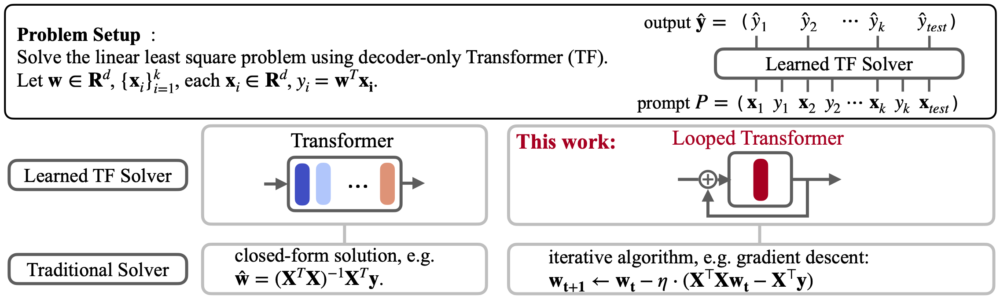

# Looped Transformers are Better at Learning Learning Algorithms
Liu Yang, Kangwook Lee, Robert D. Nowak, Dimitris Papailiopoulos 

You can find the paper in [arxiv](https://arxiv.org/abs/2311.12424).

## Overview

This codebase contains the implementation for the looped transformer, which learns from inputs generated by 
(1) linear functions, (2) sparse linear functions, (3) decision trees, and (4) ReLU 2-layer NN. 
Besides these function classes, we also include code to generate and train datasets from OpenML, 
as well as code for model probing. 
The backbone transformer code is based on [NanoGPT](https://github.com/karpathy/nanoGPT/blob/master/model.py), 
while the prompt generation code is based on 
[Garg et al.](https://github.com/dtsip/in-context-learning/tree/main)'s codebase.

<p align="center" width="100%">
    
</p>

```
@article{yang2023looped,
  title={Looped Transformers are Better at Learning Learning Algorithms},
  author={Yang, Liu and Lee, Kangwook and Nowak, Robert and Papailiopoulos, Dimitris},
  journal={arXiv preprint arXiv:2311.12424},
  year={2023}
}
```

## Setup
Please install and activate the environment through
```shell
conda env create -f environment.yml
conda activate loop_tf
```

## Running Experiments
- For standard transformer training, refer to and execute  `bash exec/script_baseline.sh`.
- For looped transformer training, refer to and execute `bash exec/script_loop.sh`.
  - The parameter `b` determines the maximum loop iteration during training.
  - The parameter `T` sets the loop window size.
- To probe a trained model, refer to and execute `bash exec/script_probe.sh`.
- To work with the OpenML dataset for both standard and looped transformers, refer to and execute `bash exec/script_openml.sh`.
- To plot and compare with baseline methods, refer to notebooks in the `jupyter_notebooks` folder.
